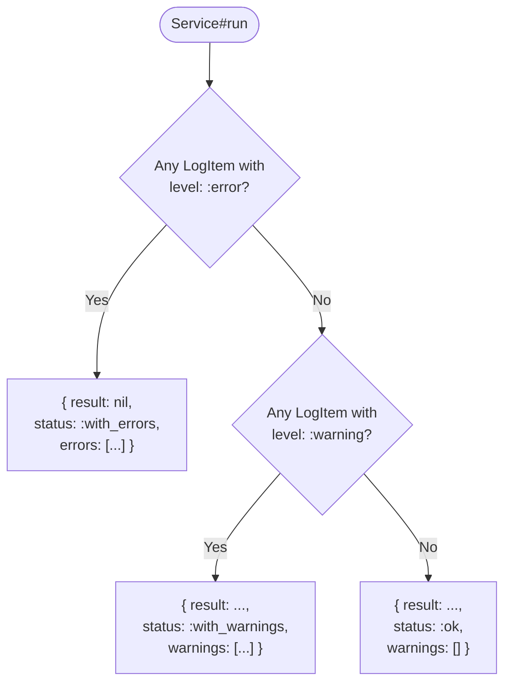

<!-- markdownlint-disable MD013 MD024 -->
# API reference

This is the hand-written, curated reference for every public symbol
that ships in `assistant` 1.0.0. The source of truth for stability
labels is
[`docs/v1/01-api-surface.md`](https://github.com/ramongr/assistant/blob/main/docs/v1/01-api-surface.md); the table
of contents here mirrors it.

Anything not listed on this page is **internal** and may change
without a major version bump.

## Stability labels

- **Frozen** — covered by semver from 1.0.0 onward. Breaking changes
  require a 2.0.
- **Experimental** — public but subject to change in a 1.x minor
  with a deprecation cycle.

## Table of contents

- [`Assistant` module](#assistant-module)
- [`Assistant::Service`](#assistantservice)
  - [Class methods](#class-methods)
  - [Instance methods](#instance-methods)
  - [Generated per-input methods](#generated-per-input-methods)
  - [Result shape](#result-shape)
- [`Assistant::LogItem`](#assistantlogitem)
- [`Assistant::LogList`](#assistantloglist)
- [Execute callbacks](#execute-callbacks)
- [Service composition](#service-composition)
- [Instrumentation notifier](#instrumentation-notifier)
- [Input snapshot](#input-snapshot)
- [`assistant-rbs` CLI](#assistant-rbs-cli)
- [Semver and deprecation policy](#semver-and-deprecation-policy)

---

## `Assistant` module

| Symbol                          | Stability                | Description                                                                              |
|---------------------------------|--------------------------|------------------------------------------------------------------------------------------|
| `Assistant::VERSION`            | Frozen                   | Semver-compliant `String`. Defined in `lib/assistant/version.rb`.                        |
| `Assistant.notifier`            | Frozen *(new in 1.0)*    | Reader for the instrumentation proc. Defaults to a no-op.                                |
| `Assistant.notifier=(callable)` | Frozen *(new in 1.0)*    | Writer. Accepts any object responding to `#call(event, payload)`.                        |

See [Instrumentation notifier](#instrumentation-notifier) below for the
event catalogue.

---

## `Assistant::Service`

Subclass `Assistant::Service` and override `#execute` (and optionally
`#validate`). Every other method on the table below is provided for
you.

### Class methods

| Signature                                                                       | Stability | Description                                                                                              |
|---------------------------------------------------------------------------------|-----------|----------------------------------------------------------------------------------------------------------|
| `Service.run(**inputs) -> Hash`                                                 | Frozen    | One-shot. Instantiates with `inputs`, calls `#run`, returns the result hash.                             |
| `Service.input(name, type:, required: false, optional: nil, if: nil, default: nil, allow_nil: false)` | Frozen | Declarative input. `name` is a leading positional symbol; everything else is keyword. See [Inputs](./guides/inputs.md). |
| `Service.inputs(names, type:, **options)`                                       | Frozen    | Bulk declaration. `names` is an `Array<Symbol>`. Options apply to every input.                           |
| `Service.before_execute(&block)`                                                | Frozen    | Hook block runs after validation, before `#execute`. `instance_exec`'d on the service.                   |
| `Service.after_execute(&block)`                                                 | Frozen    | Hook block runs after `#execute` returns; receives the result as the block argument.                     |
| `Service.around_execute(&block)`                                                | Frozen    | Hook block is `instance_exec`'d with an inner block argument that yields to the next layer.              |
| `Service.input_snapshot_class -> Class`                                         | Frozen *(new in 1.0)* | Memoised `Data.define(*declared_input_names)` class used by `#input_snapshot`.                |

> **M12 keyword-only sweep.** Every other public DSL helper (e.g.
> `merge_logs`, all `InputBuilder` internals) takes keyword arguments
> only. The two exemptions above — `Service.input` and
> `Service.inputs` — keep their leading positional `name` / `names`
> because the class-body declaration reads better as
> `input :email, type: String` than `input name: :email, type: String`.

### Instance methods

| Signature                                          | Stability             | Description                                                                                                                              |
|----------------------------------------------------|-----------------------|------------------------------------------------------------------------------------------------------------------------------------------|
| `#initialize(**inputs)`                            | Frozen                | Stores `inputs` after applying every `default:`. Does **not** run validation or `#execute`.                                              |
| `#run -> Hash`                                     | Frozen                | Runs `#validate`, the `before_execute` chain, `#execute` wrapped in `around_execute`, then `after_execute`. Returns the result hash.     |
| `#result -> Object`                                | Frozen                | Memoised return value of `#execute`. `nil` on failure.                                                                                   |
| `#success? -> Boolean`                             | Frozen                | True when status is `:ok` or `:with_warnings`.                                                                                           |
| `#failure? -> Boolean`                             | Frozen                | True when status is `:with_errors`.                                                                                                      |
| `#status -> Symbol`                                | Frozen                | Exactly one of `:ok`, `:with_warnings`, `:with_errors`.                                                                                  |
| `#logs -> Array<Assistant::LogItem>`               | Frozen *(new in 1.0)* | All accumulated log items, in the order they were added.                                                                                 |
| `#infos / #warnings / #errors`                     | Frozen                | Filtered subsets of `#logs`, by level.                                                                                                   |
| `#call_service(klass, **inputs) -> Service`        | Frozen *(new in 1.0)* | Runs another service, merges its logs into this one, returns the inner instance. Errors on the inner flip this service to `:with_errors`. |
| `#input_snapshot -> Data`                          | Frozen *(new in 1.0)* | Frozen value object capturing the post-default, post-`allow_nil` inputs. See [Composing services](./guides/composing-services.md).         |
| `#execute -> Object` (override)                    | Frozen                | Your subclass overrides this. Return value becomes `result:`.                                                                            |
| `#validate -> void` (override)                     | Frozen                | Optional. Add log items here to short-circuit `#execute`.                                                                                |

### Generated per-input methods

For every `input :name, type: T` declaration, the following are
generated as instance methods on the service:

| Method                                  | When generated                          | Description                                                                                                |
|-----------------------------------------|-----------------------------------------|------------------------------------------------------------------------------------------------------------|
| `#name`                                 | Always                                  | Reader for the post-default value of the input.                                                            |
| `#name?`                                | Always                                  | Present-and-truthy predicate. Whitespace-only strings are treated as missing.                              |
| `#valid_type_name? -> Boolean`          | Always                                  | True when `name` matches the declared `type:` (or is one of an `Array` type).                              |
| `#valid_required_name? -> Boolean`      | When `required: true`                   | True when `name` is present (uses `#name?`). **Canonical name in 1.0.**                                    |
| `#valid_require_name? -> Boolean`       | When `required: true`                   | **Deprecated in 1.0**, removed in 2.0. Delegates to `#valid_required_name?` with a `Kernel.warn` per call site. |
| `#valid_required_conditional_name? -> Boolean` | When `required: true` **and** `if:` is supplied | True when the `if:` predicate is truthy **and** `name` is present.                                        |
| `#valid_require_conditional_name? -> Boolean`  | Same                                  | **Deprecated in 1.0**, removed in 2.0. Delegates with a warning.                                          |

See [`docs/deprecations.md`](./deprecations.md) for the deprecation
table and migration recipe.

### Result shape

`Service#run` (and therefore `Service.run`) always returns one of two
hash shapes:

```ruby
# Success
{ result: <Object>, status: :ok | :with_warnings, warnings: Array<LogItem> }

# Failure
{ result: nil, status: :with_errors, errors: Array<LogItem> }
```

The status enum is exhaustively `:ok`, `:with_warnings`, `:with_errors`.
No new status values may be added in 1.x without a deprecation cycle.

The status flag is derived purely from what the service logged during
`#run`:



`#execute` is **skipped** entirely when any declarative or custom
`#validate` check has already logged an error — see the
[Validation guide](guides/validation.md) for the full lifecycle.

---

## `Assistant::LogItem`

> **Breaking change in 1.0 (M10).** `LogItem.new` now raises
> `ArgumentError` when any required attribute is invalid. The
> `#valid?` family is **retained** for introspection, but in normal
> flows it always returns `true` after a successful `new`.

| Signature                                                                                | Stability                |
|------------------------------------------------------------------------------------------|--------------------------|
| `LogItem.new(level:, source:, detail:, message:, trace: nil)`                            | Frozen *(raises in 1.0)* |
| `#level / #source / #detail / #message / #trace` — readers                               | Frozen                   |
| `#info? / #warning? / #error?` — level predicates                                        | Frozen                   |
| `#valid? / #valid_level? / #valid_source? / #valid_detail? / #valid_message?`            | Frozen                   |
| `#item -> Hash{Symbol => Object}`                                                        | Frozen                   |
| `Assistant::LogItem::VALID_LEVELS` — `%i[info warning error]`                            | Frozen                   |

`#level`, `#source`, `#detail` are always `Symbol`; `#message` is
`String`; `#trace` is `String` or `nil`.

---

## `Assistant::LogList`

Mixin module included in `Assistant::Service`. Users don't normally
include it themselves; the methods are available on any service
instance.

| Signature                                                          | Stability                |
|--------------------------------------------------------------------|--------------------------|
| `#add_log(level:, source:, detail:, message:, trace: nil)`         | Frozen                   |
| `#merge_logs(logs:)`                                               | Frozen *(keyword-only in 1.0)* |
| `#log_item_error_initialize(attr_name:, message:)`                 | Frozen                   |
| `#log_item_info(source:, detail:, message:, trace: nil)`           | Frozen *(new in 1.0)*    |
| `#log_item_warning(source:, detail:, message:, trace: nil)`        | Frozen *(new in 1.0)*    |
| `#log_item_error(source:, detail:, message:, trace: nil)`          | Frozen *(new in 1.0)*    |
| `#infos / #warnings / #errors -> Array<LogItem>`                   | Frozen                   |

See [Logging and results](./guides/logging-and-results.md) for the
`log_item_*` shorthands vs. the explicit `add_log` form.

---

## Execute callbacks

New in 1.0. Class-level DSL on `Assistant::Service`; see the table
under [Class methods](#class-methods).

Hook error semantics: an exception raised inside any `before_execute`,
`after_execute`, or `around_execute` hook is caught and logged via
`add_log(level: :error, source: :hook, ...)` — it **never** propagates
out of `#run`. See [Composing services](./guides/composing-services.md).

---

## Service composition

| Signature                                                  | Stability                |
|------------------------------------------------------------|--------------------------|
| `#call_service(klass, **inputs) -> Assistant::Service`     | Frozen *(new in 1.0)*    |

Constructs `klass`, runs it, merges the inner instance's `#logs` into
the caller's, and returns the inner instance for further inspection.
If the inner service has any error-level log item, the outer service's
status becomes `:with_errors`.

---

## Instrumentation notifier

Configured via `Assistant.notifier = ->(event, payload) { ... }`.

Events emitted in 1.0, each with a payload that always carries
`:service_class` and `:duration_s`:

- `:service_started`
- `:service_validated`
- `:service_executed`
- `:service_failed`

The event set is **Frozen** for 1.0. Adding events requires a minor
release; removing one or removing a payload key requires a full
deprecation cycle.

---

## Input snapshot

| Signature                          | Stability                | Description                                                                                                  |
|------------------------------------|--------------------------|--------------------------------------------------------------------------------------------------------------|
| `#input_snapshot -> Data`          | Frozen *(new in 1.0)*    | Returns a frozen `Data.define(*declared_input_names).new(**post_default_inputs)`. Reflects post-`default:` / post-`allow_nil:` values. |

The `Data` class is memoised on the service class — repeated calls
return values whose `class` is `equal?`. See
[Composing services](./guides/composing-services.md).

---

## `assistant-rbs` CLI

Bundled executable shipped at `exe/assistant-rbs` (M11). Generates
per-class RBS signatures for `Assistant::Service` subclasses so Steep
can type-check user code.

| Invocation                                                  | Stability     |
|-------------------------------------------------------------|---------------|
| `bundle exec assistant-rbs PATH [--output sig/]`            | Experimental  |

Scans `PATH` for `Assistant::Service` subclasses and emits
`sig/<class>.rbs` with `def name: () -> Type` and `def name?: () -> bool`
per declared input. A multi-type `type:` produces a union; `allow_nil:`
produces a nullable type. The output is idempotent — running twice
overwrites the same file with the same contents.

Labelled **Experimental** in 1.0 because the output format may evolve
in 1.x as RBS support for richer types matures.

---

## Semver and deprecation policy

- **Patch (1.0.x)**: bug fixes, doc updates, internal refactors with no
  observable behaviour change.
- **Minor (1.x.0)**: additive API only — new `input` options, new
  `LogItem` predicates, new `Service` hooks. No removals.
- **Major (2.0.0)**: removals, renames, behaviour changes that break
  the contract above.

Every deprecated symbol lives for **at least one further minor** after
its deprecation, with a `Kernel.warn` runtime warning and a row in
[`docs/deprecations.md`](./deprecations.md).
