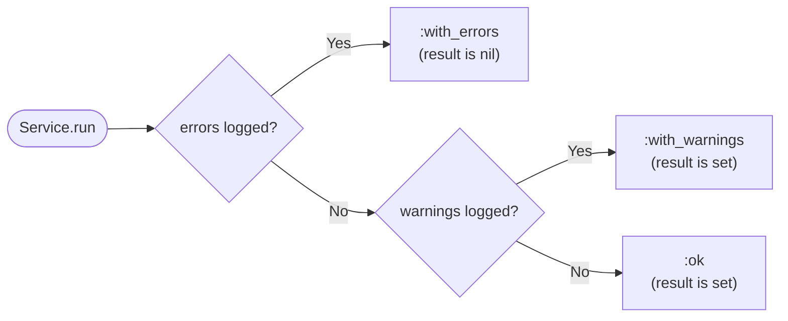

<!-- markdownlint-disable MD013 MD024 -->
# Getting started

> **TL;DR** — Subclass `Assistant::Service`, declare your inputs with
> `input`, write an `execute` body, and call `YourService.run(**args)`.
> You always get a hash back: either
> `{ result:, status: :ok | :with_warnings, warnings: [...] }` or
> `{ result: nil, status: :with_errors, errors: [...] }`. The gem
> never raises for expected failures.

This page walks a brand-new user from `gem install` to a working
service. For deeper topics, jump to the guides:

- [Inputs](./guides/inputs.md) — every option on `input` and `inputs`.
- [Validation](./guides/validation.md) — the `validate` hook and how
  to log warnings vs. errors.
- [Logging and results](./guides/logging-and-results.md) — `LogItem`,
  the `log_item_*` shorthands, the result hash.
- [Composing services](./guides/composing-services.md) — `call_service`,
  callbacks, the instrumentation notifier, `#input_snapshot`.

The API contract is enumerated in
[`api-reference.md`](./api-reference.md).

## Install

With Bundler (recommended):

```sh
bundle add assistant
```

Without Bundler:

```sh
gem install assistant
```

Ruby `>= 3.4` is required. The gem has **zero runtime dependencies** —
adding it never pulls in another gem.

## Your first service

Create a file `create_user.rb`:

```ruby
require 'assistant'

class CreateUser < Assistant::Service
  input :email, type: String,  required: true
  input :name,  type: String,  required: true
  input :age,   type: Integer, allow_nil: true, default: nil

  def validate
    return if email.include?('@')

    log_item_error(source: :validate, detail: :email, message: 'must contain @')
  end

  def execute
    log_item_warning(source: :execute, detail: :age, message: 'age missing') if age.nil?

    { id: 42, email:, name:, age: }
  end
end
```

Run it:

```ruby
CreateUser.run(email: 'a@b.com', name: 'Alice')
# => { result: { id: 42, email: "a@b.com", name: "Alice", age: nil },
#      status: :with_warnings,
#      warnings: [#<Assistant::LogItem level=:warning ...>] }

CreateUser.run(email: 'oops', name: 'Bob', age: 30)
# => { result: nil,
#      status: :with_errors,
#      errors: [#<Assistant::LogItem level=:error  ...>,
#               #<Assistant::LogItem level=:error  ...>] }

CreateUser.run(email: 'c@d.com', name: 'Carol', age: 30)
# => { result: { id: 42, ... }, status: :ok, warnings: [] }
```

Three runs, three different statuses, **zero exceptions**.

## Reading the result hash

Every `Service.run` returns one of two shapes:

```ruby
# Success (status is :ok or :with_warnings)
{ result: <Object>, status: :ok | :with_warnings, warnings: Array<LogItem> }

# Failure
{ result: nil, status: :with_errors, errors: Array<LogItem> }
```

Pattern-matching is the cleanest way to consume it:

```ruby
case CreateUser.run(email: 'a@b.com', name: 'Alice')
in { result:, status: :ok }
  render json: result
in { result:, status: :with_warnings, warnings: }
  WarningsLogger.log(warnings)
  render json: result
in { errors:, status: :with_errors }
  render json: { errors: errors.map(&:item) }, status: :unprocessable_entity
end
```

The `:status` value is exhaustively one of `:ok`, `:with_warnings`,
`:with_errors`. No new status values can be introduced in 1.x without a
deprecation cycle.

At a glance, that decision is just:



## What's next

- The same example, but with optional / multi-type inputs and a
  `default:` lambda → [Inputs guide](./guides/inputs.md).
- Logging structured warnings during `#execute`, conditional
  validation, the strict `LogItem` constructor →
  [Logging and results](./guides/logging-and-results.md) +
  [Validation](./guides/validation.md).
- Wrapping one service inside another with shared log merging →
  [Composing services](./guides/composing-services.md).
- Per-class RBS signatures for Steep users → run
  `bundle exec assistant-rbs lib --output sig`. See the
  [Inputs guide](./guides/inputs.md) for the limitation it works
  around.
