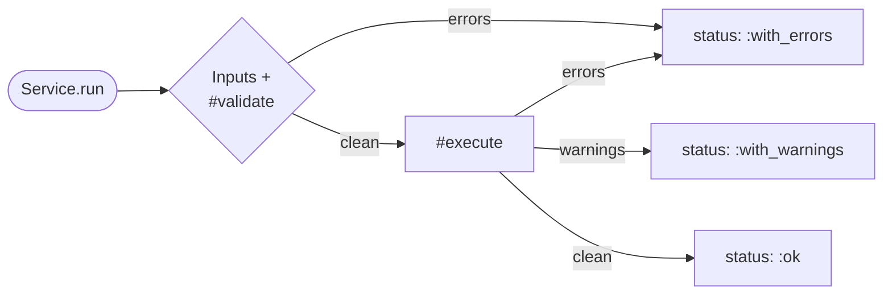

<h1 class="assistant-home-wordmark">
  
</h1>

**Tiny, dependency-free soft-fail service objects for Ruby.**

[](https://rubygems.org/gems/assistant)
[](https://github.com/ramongr/assistant/actions/workflows/ci.yml)
[](https://github.com/ramongr/assistant/actions/workflows/docs.yml)

A service declares its inputs, validates them, runs its body, and returns a
uniform result hash that always carries either a value plus warnings, or a
list of errors. Frozen 1.0 public API. RBS signatures ship in `sig/`.
**Zero runtime gem dependencies.**

> [Get started in 60 seconds](getting-started.md) &nbsp;·&nbsp;
> [Browse the guides](guides/inputs.md) &nbsp;·&nbsp;
> [View on GitHub](https://github.com/ramongr/assistant)

---

## Why Assistant?

| Soft-fail by default | Zero runtime deps | Typed and Steep-ready |
|:---|:---|:---|
| Expected failures become structured `LogItem` errors with a `:status`, not raised exceptions. Callers pattern-match on the result. | The gemspec declares zero runtime dependencies, and CI enforces it on every push. Drop-in for any Ruby 3.4+ project. | Hand-curated RBS sidecars for the public API plus the `assistant-rbs` generator for your own services. Steep-checked in CI. |

---

## How a service flows



Validation runs first; `#execute` is skipped entirely when errors are already
on the log. Warnings never short-circuit anything — they ride along on the
result so the caller can decide what to surface.

---

## Install

Assistant 1.0 is currently in release-candidate. Pin the RC explicitly:

```ruby
# Gemfile
gem 'assistant', '1.0.0.rc1'
```

```sh
bundle install
```

Once `1.0.0` ships, use the standard pessimistic pin:

```ruby
gem 'assistant', '~> 1.0'
```

Ruby 3.4 or newer is required.

---

## The 60-second example

```ruby
require 'assistant'

class CreateUser < Assistant::Service
  input :email, type: String, required: true
  input :name,  type: String, default: 'Anonymous'

  def execute
    log_item_info(source: :create_user, detail: :persisted, message: "saved #{email}")
    User.create!(email: email, name: name)
  end
end

case CreateUser.run(email: 'me@example.com')
in { result:, status: :ok }
  result
in { errors:, status: :with_errors }
  errors.map(&:item)
end
```

The same call returns `:with_warnings` if `#execute` logged any warnings, and
`:with_errors` (without invoking `#execute`) if the inputs failed validation.

> [Walk through this example end-to-end &raquo;](getting-started.md)

---

## Where to next

| Page | What you'll find |
|:---|:---|
| [Getting started](getting-started.md) | Install, your first service, consuming a result. |
| [Inputs guide](guides/inputs.md) | The `input` DSL — types, defaults, optional, conditional. |
| [Validation guide](guides/validation.md) | Built-in checks, `#validate`, warning vs error semantics. |
| [Logging and results](guides/logging-and-results.md) | `LogItem`, `LogList`, the result hash shape. |
| [Composing services](guides/composing-services.md) | `call_service`, callbacks, notifier, `#input_snapshot`. |
| [RBS and types](guides/rbs-and-types.md) | Hand-curated sidecars + `bin/assistant-rbs`. |
| [API reference](api-reference.md) | Every Frozen symbol in 1.0, deep-link friendly. |
| [Examples](examples/rails-service.md) | Wiring patterns — Rails, CLI, Sidekiq, callbacks, notifier, RBS. |
| [Deprecations](deprecations.md) | What's flagged for removal in 2.0. |

---

Source on [GitHub](https://github.com/ramongr/assistant) · Released under the
[MIT License](https://github.com/ramongr/assistant/blob/main/LICENSE.txt) ·
Contributions welcome — see
[CONTRIBUTING.md](https://github.com/ramongr/assistant/blob/main/CONTRIBUTING.md).
